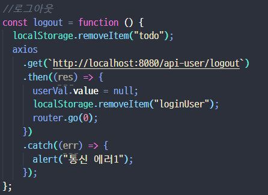
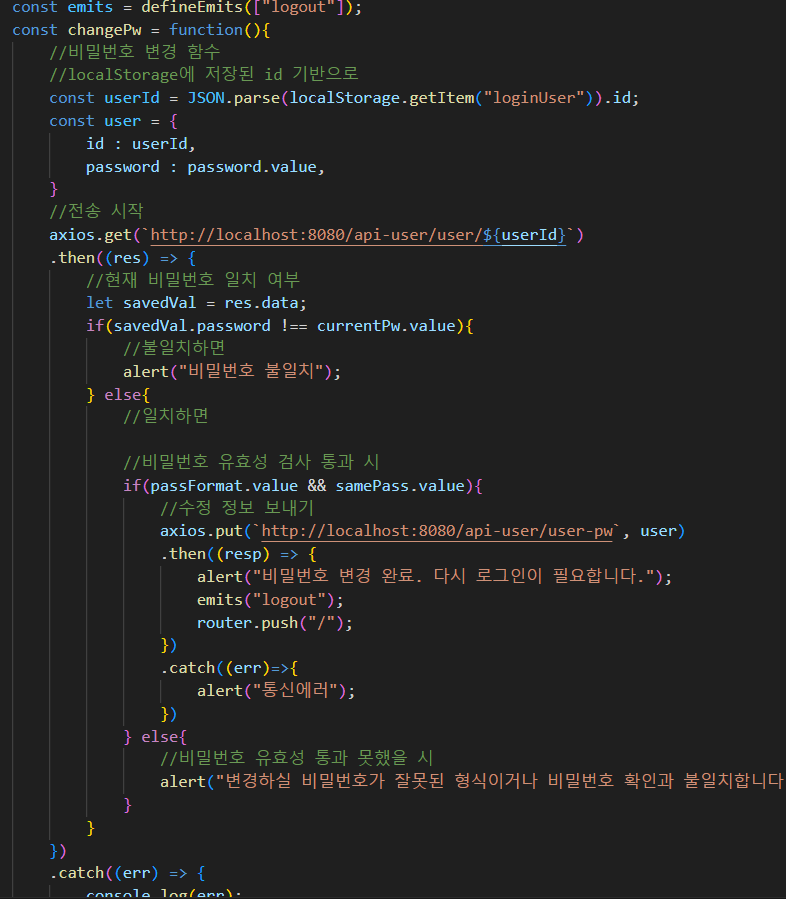

# 오늘의 (맨몸 운동왕) 프로젝트

## 개요
- 운동이 부족한 현대인들을 위한 맨몸 운동 To-do list 사이트 제작
- 2인이서 구현

## 내가 맡은 파트 및 회고
1. 역할 분담
    - 나는 팀장으로 참여했습니다.
    - 둘의 기술 스택이 비슷하고, 기능이 단순한 편이었기에 기능별로 분담하는 것이 좋다고 판단, 유저에 대한 CRUD(회원 가입, 회원 정보 수정, 회원 탈퇴, 로그인, 로그아웃, 비밀번호 변경)을 맡았습니다.
    - 그 후, 구현에 들어갔습니다.

2. DB 설계

    - DB 설계는 둘이서 같이 진행하였습니다.
    - 유저의 To do list 정보를 일일이 저장하는 것은 DB에 큰 부담을 줄 수 있고, 복잡해지기 때문에, To do list는 프론트엔드 단에서 구현하고, DB의 경우 다음 내용들을 포함하도록 구성하였습니다.
        - 유저의 정보(user 테이블)
        - 유저의 점수 정보(score 테이블)
        - 맨몸 운동의 종류와 점수(exercise 테이블)
    - score테이블의 경우 user테이블의 id정보를 외래키로 하는 userId 칼럼을 지정해 두 테이블간의 관계를 지정하였습니다.

3. 기능 설계
- [피그마 링크](https://www.figma.com/file/iMSXIdEunshLHTqTAscRtD/1%ED%95%99%EA%B8%B0-%EC%B5%9C%EC%A2%85-pjt?type=design&node-id=0-1&mode=design&t=JWUognR0Ac09sCpz-0)
- 어떤 기능을 넣을지에 대한 구상은 figma를 통해 목업을 만들어 보면서 진행하였습니다.
- 이 과정에서 나온 구현해야 하는 기능들은 다음과 같습니다.
    - To Do List
        - 운동 추가
        - 운동 삭제
        - 운동 체크표시
        - 점수 DB에 반영
    - 나의 점수 출력
    - 랭킹 출력
    - 로그인/로그아웃
    - 회원 가입, 회원 정보 수정, 회원 탈퇴
    - 마이페이지
- 이 외에도 나중에 부가적으로 있으면 좋을 것 같아 추가한 기능들도 있습니다.
    - 타이머, 알람 기능
    - 유튜브 API를 이용한 정보 검색 기능

### 내가 맡은 기능은?
- 여기서 제가 맡은 기능은 다음과 같습니다.
    - 회원 가입, 회원 정보 수정, 회원 탈퇴
    - 마이페이지, 나의 점수 출력, 랭킹 출력
    - 로그인, 로그아웃
    - 타이머, 알람
    - 유튜브 API 이용 정보 검색 기능

4. 백엔드 구현

- 백엔드는 REST API를 통해 요청을 받으면 정보를 보내주는 방식으로 구성되어 있고, 저는 그 중에서 유저 컨트롤러의 기능을 구현하였습니다.

### 코드 설명
이제 코드를 살펴보겠습니다. 각 기능별로 살펴보겠습니다.

- 우선 컨트롤러는 RestController이고, userService를 주입받아 동작합니다. userService는 userDao를 주입받아 동작하고, userDao는 userMapper에 매핑되어 있습니다. 사용하는 DTO는 User DTO로, DB의 user table과 컬럼명을 일치시켰습니다.

#### login 메서드

- 컨트롤러가 로그인 관련 요청을 받으면 login 메서드가 실행됩니다. RequestBody를 통해 id, password가 User DTO로 넘어오고, 여기서 id, password값만 추출해 UserServiceImpl의 siginin 메서드를 실행합니다.
- 이 메서드는 UserDao를 통해 DB에 접근해 해당 id의 인물이 존재하는지, 또, 입력된 비밀번호가 일치하는지 확인합니다. 만약 그렇다면, 해당 인물의 정보를 반환합니다.
- 만약 로그인 정보가 없다면 컨트롤러는 HttpStatus.UNAUTHORIZED를 반환합니다. 있다면, UserServiceImpl의 initScore메서드를 실행시키는데, 이 메서드는 userDao를 통해 DB에 접근해 해당 유저의 todayScore를 0으로, lastRegDate를 로그인 시점으로 갱신합니다. 이를 통해 로그인 후 오늘의 점수를 초기화합니다. 그 후, controller는 일치하는 user 정보를 모두 보내고, HttpStatus.OK를 보냅니다.

#### 로그아웃

- 이 메서드는 아무런 기능이 없습니다. 과거 로그아웃 시 백에서 처리할 일이 있을까봐 구현했으나, 결국 아무 기능도 안했습니다.

#### 아이디 중복 방지 체크

- 원래는 유저 정보를 모두 들고와 프론트엔드 단에서 처리하게 하려 했으나, 초기 로딩 속도가 길어질 것이 염려되어 바꾸었습니다.
- 유저가 회원가입 시 아이디 중복 방지를 위해 체크를 하면, userService.getUserList를 호출하고, 이 함수는 userDao.selectAll을 호출하여 모든 유저 정보를 받아옵니다.
- 여기서 PathVariable로 들어온 아이디를 조회해 일치하는 것이 있으면 false, 없으면 true를 반환해 true인 경우만 아이디 사용이 가능하도록 하였습니다.

#### 회원 가입

- 회원가입 시에는 정보를 받아 userService.signup메서드를 실행합니다.
- 이 메서드는 userDao.insertUser를 실행합니다. 이 메서드를 통해 DB에 접근 해 우선 User 테이블로 가서 유정 정보를 INSERT하고, Score 테이블로 가서 초기 점수 관련 내역을 넣어줍니다. 이렇게 회원 정보를 DB에 저장합니다.
- 이 과정에서 dataSource.url을 allowMultiQueries=true로 해주어 2개 이상의 SQL 구문이 실행되도록 하였습니다.
- service에서 Transactional을 통해 비정상적인 실행을 차단했습니다.

#### 회원 정보 수정

- 회원 정보 수정은 modify메서드로 실행되며, userService, userDao를 거쳐 UPDATE구문을 이용해 DB에 입력값을 반영하는 방식입니다. 이 때, RequestBody를 통해 수정할 내용(닉네임, 자기소개, 이메일주소)를 받고, PathVariable로 받은 id로 어느 레코드인지 특정합니다.
- service에서 Transactional을 통해 비정상적인 실행을 차단했습니다.

#### 회원 탈퇴

- 회원탈퇴 시, controller의 delete메서드가 실행되고, userService.deleteUser, userDao.deleteUser를 거쳐 DB에서 DELETE문을 실행해 정보를 삭제합니다.
- 이 때, 입력된 id값을 통해 외래키로 참조하고 있는 Score 테이블의 userId가 id와 일치하는 레코드를 먼저 삭제하고, User 테이블의 정보를 삭제합니다. 유저 데이터는 없이 점수 데이터만 덩그러니 남는 문제를 일으키지 않기 위해 이러한 조치를 취했습니다.

#### 마이페이지를 위한 정보 가져오기

- 이 함수는 마이페이지 접속 시, 유저 정보가 필요하다는 점 때문에 만들었습니다.
- 컨트롤러로 요청이 들어오면 userService.myPage, userDao.selectOne을 통해 PathVariable로 들어온 id에 해당하는 유저 정보를 반환합니다. 만약 그런 유저가 없다면 HttpStatus.NO_CONTENT를 보냅니다.

#### 비밀번호 변경

- 원래 비밀번호 변경은 회원 수정 페이지에서 같이 하려고 했으나, 비밀번호는 다른 정보보다 더 중요하다고 판단해 모듈화 시켜 독립된 페이지로 바꾸었습니다.
- 그러면서 이를 위한 메서드를 따로 만들었고, 그게 changePw입니다. 컨트롤러에서 이 메서드가 실행되면 userService.changePw, userDao.changePw를 거쳐, DB의 User테이블에서 id값에 해당하는 비밀번호를 변경합니다. id, 새로운 password정보는 User라는 DTO로 한꺼번에 보냅니다.

### 여기까지가 백엔드에 관한 설명입니다. 이렇게 REST API가 완성된 후, 저는 프론트엔드 기능 구현을 시작했습니다.

5. 프론트엔드 구현
- 기본적으로 여러 기능들로 이루어진 페이지 특성상, CSS를 포함한 여러 부분은 공동으로 작업을 진행하였습니다. 그렇기에 저는 프론트엔드에서 제가 구현한 '기능'에 초점을 맞추어 설명드리겠습니다.
- 저는 다음과 같은 기능들을 구현하였습니다.
    - 로그인/로그아웃
    - 랭킹(전체 랭킹 페이지, 메인 페이지)
    - 회원가입, 수정, 탈퇴
    - 비밀번호 변경
    - 타이머/알람
    - 유튜브 API를 이용한 검색

- 이제부터 이 기능들을 설명하겠습니다.

#### 로그인/로그아웃

- 로그인은 LoginForm.vue에서 진행합니다. 로그인을 하면, id, password정보가 user라는 객체에 담기고 loginReq라는 emit을 합니다.
- App.vue에서 이를 받아 login이라는 callback함수를 실행합니다. axios통신을 통해 REST_API로 요청을 보내 일치하는 유저의 정보를 수신합니다. 일치할 경우, 이 때 받은 데이터 중 id, nickname만 따로 빼서 localStorage에 loginUser라는 값으로 JSON.stringfy처리를 한 후 저장하는데, 이는 모든 정보를 저장할 경우 생기는 보안 문제를 방지하기 위해서입니다.
- 이 후, router를 통해 메인 페이지로 돌아옵니다.

- 로그아웃은 HeaderNav.vue의 버튼을 눌러 진행합니다.
- 이 버튼을 누르면 메인페이지로 push되며 logout을 emit하는데, App.vue에서 이를 받아 logout이라는 callback함수를 실행합니다.
- localStorage에서 todo라는 to-do list를 저장해놓는 요소가 있는데, 이를 제거하고, axios통신을 한 후(현 시점에서는 의미 없음), localStorage에서 loginUser를 삭제한 후, 새로고침하여 로그아웃을 진행합니다.

#### 랭킹

- 전체 랭킹 페이지에 필요한 정보는 우선 loadRanking이라는 메서드를 실행시켜 axios통신을 통해 랭킹 정보를 받아오고, myRanking이라는 메서드를 실행시켜 loginUser에 저장되어 있던 정보를 기반으로 반복문을 통해 제 랭킹 정보를 받아와 출력하였습니다.

- 메인 화면의 랭킹 정보 역시 이와 같은 방식으로 들고 오나, 작은 화면에 맞추어 전체 랭킹을 보여줄 때 다른 메커니즘을 필요로 했습니다.
- setInterval함수를 이용해 보여주는 랭킹 정보를 1.5초간격으로 바꾸게 설정하여 랭킹을 하나씩 보여주었습니다.

#### 회원가입

- 회원가입은 제가 가장 공들인 기능 중 하납니다. 회원가입 시 정보의 유효성을 검사하기 위한 알고리즘을 짜는 것이 상당히 어려웠습니다.
- 회원가입은 RegistForm.vue로 진행하였습니다.
- 보내줄 유저 정보가 담길 user 객체가 있고, id, 닉네임, 비밀번호, 이메일, 자기소개를 담아 보냅니다.
- 유효성 검사는 다음과 같습니다.
    - dupleChecked : 아이디가 중복되는지 체크, 중복이 아니라는 것이 확인되면 true가 됩니다.
    - passFormat : 비밀번호가 8자리 이상의 특수문자 포함인지 체크합니다.
    - samePass : 비밀번호와 비밀번호 확인에 들어가 있는 데이터의 일치 여부를 검사합니다. computed를 이용해 두 값을 비교했습니다.
    - emailFormat : 이메일 형식을 체크합니다. '@'이 들어가 있는지가 기준입니다.

##### 아이디 중복 검사
- 위의 form에 작성한 id는 tempId라는 값과 양방향 바인딩되어 있습니다. 이는 유효성 검사를 통과하지 않은 아이디가 user.id로 들어가는 것을 방지하기 위함입니다.
- 아이디 중복 확인 버튼을 누르면 checkDuple 메서드가 실행되고, axios통신을 통해 tempId값이 사용 가능한 경우만 user.id에 해당 값 저장, dupleChecked 값을 true로 바꿉니다. 통신의 응답이 false면 중복된 아이디이므로 alert로 이를 알리고 dupleChecked를 false로 합니다.
- watch를 통해 tempId값이 변경되면 dupleChecked를 false로 바꿉니다. 이는 유효성 확인을 받은 후 아이디를 임의로 변경하면 다시 검사하도록 하기 위해서입니다.

##### 비밀번호 유효성 검사
- 우선 반복문을 통해 특수 문자가 있는지 여부를 검사하였습니다.
- 검사 후에는 search 메서드를 통해 공백의 존재 여부를 검사했습니다.
- 이 둘을 통과해야 passFormat의 값은 true로 바뀝니다.

##### 이메일 형식 검사
- 위와 마찬가지로 email에 @이 있는지를 검사해 있어야만 emailFormat을 true로 바꾸었습니다.

##### 회원가입
- 회원가입 버튼을 누르면 모든 유효성 값이 true인지 검사해 그런 경우에만 axios통신을 통해 회원가입을 진행하고, 메인페이지로 돌아갑니다. 아닌 경우에는 alert로 유효하지 않은 부분이 있음을 알립니다.

#### 회원정보 수정

- 우선 회원정보 수정을 위한 초기 정보를 로드합니다. localStorage에 저장된 id를 통해 axios통신을 진행하여 DB에서 유저 정보를 받아옵니다.
- 그 후, 정보를 수정하는데, 회원가입할 때의 passFormat, emailFormat을 검사하는 로직을 그대로 활용해 유효성을 검사했습니다.
- 수정 완료 버튼을 누르면 modify 메서드가 실행됩니다. passFormat, emailFormat, 그리고 nickname이 공백이 아닌지를 검사하여 모두 true이면 axios통신을 통해 해당 정보를 반영하고 자동 로그아웃 후 메인 홈페이지로 push합니다.
- ModifyUser.vue에서 진행합니다.

#### 회원정보 삭제

- 회원 탈퇴 버튼을 누르면 withdraw 메서드가 실행되고, confirm을 통해 회원 탈퇴 확인 창을 띄웁니다.
- 확인을 누르면 axios통신을 통해 회원 탈퇴를 진행한 후, logout, 메인 페이지로 push를 진행합니다.
- ModifyUser.vue에서 진행합니다.

#### 비밀번호 변경

- 비밀번호 변경은 따로 모듈화 시켜 PasswordChange.vue에서 실행합니다.
- 현재 비밀번호, 변경할 비밀번호, 비밀번호 확인 창으로 구성됩니다.
- 전송을 하고자 사면 axios통신을 통해 id에 맞는 비밀번호를 조회합니다. 그리고 현재 비밀번호에 적힌값과 대조해 현재의 비밀번호를 제대로 입력했는지 확인합니다.
- 그 후, 일치하면 기존 회원가입 시에 활용한 passFormat, samePass 유효성 검사 알고리즘을 활용해 유효성 검사를 하고, 통과한 경우만 axios통신을 통해 비밀번호를 변경합니다.
- 그 후, 로그아웃과 메인페이지로 push를 진행합니다. 

#### 타이머, 알람

- 기능을 거의 다 완성할 때 쯤, 문득 스탑워치나 알람이 있으면 운동할 때 더 편하겠다는 생각을 하게 되었습니다. 그래서 구현해 보았습니다. StopWatch.vue에 있습니다.
- toggleMode를 통해 토글 버튼을 누르면 모든 값을 초기화하고 mode를 변환합니다. mode 0은 스탑워치, 1은 알람기능입니다.
- stopWatch는 watch와 setInterval기능을 이용합니다. 시작 버튼을 누르면 active라는 값이 1이 되는데, 이 때, setInterval로 10ms마다 시간이 10ms씩 증가하는 timer함수를 실행합니다. 정지 버튼을 누르면 active가 0이 되는데, 이 때, clearInterval로 동작을 정지합니다. 리셋 버튼을 누르면 acitve의 값과 모든 값을 0으로 초기화합니다.
- alarm은 버튼을 통해 10초, 1분 단위로 조절 가능하고, 시작 버튼을 누르면 activeAlarm이 1이 되며 setInterval 메서드를 통해 매 1초마다 alarm 메서드를 실행합니다. 이 메서드는 시간을 1초씩 줄입니다. 만약 정지 버튼을 누르면 clearInterval로 알람을 일시 정지합니다.
    - 만약 시계의 값이 -1초가 되면, alramEnd를 1로 바꾸어 watch에 있던 콜백 함수를 실행합니다. 시간 값을 초기화하고, alert창으로 시간 완료를 알린 후, alarmEnd와 activeAlarm을 0(비활성화)상태로 전환합니다.

#### 유튜브 검색

- 운동을 할 때, 이 운동이 무엇인지, 자세가 정확히 어떤지는 꼭 알아야 할 정보입니다. 그래서 사이트에 유튜브 검색 기능이 있으면 좋겠다는 생각을 하였고, Youtube API를 활용하여 문제를 해결하였습니다.
- SearchYouTube.vue에서 문제를 해결하였고, 유튜브 검색 키워드를 입력하면 모달창을 통해 유튜브 영상 3개를 띄우는 방식을 사용했습니다. 이 때, pinia를 이용하여 src/stores.youtube.js로부터 정의되어 있던 youtubeSearch 메서드를 이용해 받아온 영상 정보를 youtube.js에 있던 videos 배열에 저장해 SerachYoutube.vue에서 사용하는 방식을 사용했습니다.
- 검색 결과의 videoId값을 추출해 iframe을 통해 영상을 띄웠습니다.

## 소감
- 이렇게 여러 사람이서 장기간의 프로젝트를 진행한 것은 처음이었기에 상당히 재미있는 경험이었습니다.
- 처음 시작할 때는 간단한 to-do list사이트였다는 점에서 빨리 끝나면 어쩌지라고 생각했지만, 구현 과정에서 고려해야 하는 이슈가 상상 이상으로 많아서 힘들었습니다. 하지만 팀원과 함께 협업을 진행하여 모든 문제를 잘 해결할 수 있었습니다.
- 회고를 진행하면서 쓸데 없는 코드나 시간을 조금 더 들인다면...싶은 기능도 떠오릅니다. 다음에 할 때는 더 많이 공부해서 더 효율적인 코드를 작성하는가 하면, DB를 약간 변경해 프로필 사진 기능도 구현할 수 있으면 좋을 것 같습니다.
- 이번에는 Vue.js를 배워서 이를 응용했습니다. 확실히 Vanilla JS에 비해 더욱 간단하게 많은 기능을 구현할 수 있었습니다. 특히, 데이터 바인딩과 SPA를 위한 라우터 구성, 구성요소의 Component화가 인상깊었습니다.
- 만약 다음에 도전해 본다면 Front End의 경우 React를 배워 도전해 보고 싶습니다. Vue.js가 싫어서가 아니라 다양한 프레임워크를 경험할 필요가 있다고 생각하기 때문입니다.